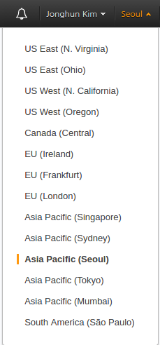
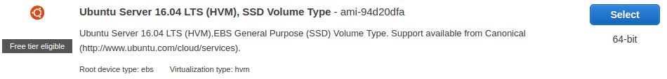

---

### 시작하기

- AWS 콘솔 페이지에서 국가설정을 **Asia Pacific(Seoul)** 로 설정해줍니다



- AWS sevices 창에서 EC2를 검색하여 **EC2 대시보드 페이지** 로 이동합니다

-  를 클릭합니다

-  우분투 서버를 선택합니다

- 그 이후에는 바로 하단의  버튼을 클릭하여 인스턴스를 생성합니다

- Launch 버튼을 클릭하고나면 public key와 private key 한쌍을 선택하는 창이뜹니다
기존에 만들어진 키가 없다면 키를 생성하고 키를 다운로드하여 `~./ssh` 경로로 이동시킵니다
(키를 한번 만들면 다시는 확인할 수 없으니 꼭 저장해야한다)

- 이제 생성된 인스턴스를 확인할 수 있습니다

- 인스턴스의 이름을 지정해 줄 수도 있습니다

---

### 로컬에서 설정하기

<br>

#### 우분투 서버 터미널 접속하기

- **/.ssh** 폴더에서 생성한 **key pairs(~.pem)** 파일을 소유자만 읽을 수 있게 권한설정을 해줍니다
```
chmod 400 <key pairs 이름>.pem
```

- 명령을 통해 서버 터미널에 접속합니다
```
/ ssh -i <key pairs 파일의 위치> ubuntu@<Public DNS>
```

> Public DNS는 본인의 인스턴스 페이지 하단에서 확인할 수 있습니다

---

#### 우분투 서버 기본 설정하기

>우분투 서버 터미널에서 진행합니다
>서버터미널과 로컬터미널을 헷갈리기 쉽습니다

python-pip설치

```
sudo apt-get install python-pip
```

zsh 설치

```
sudo apt-get install zsh
```

oh-my-zsh 설치

```
sudo curl -L http://install.ohmyz.sh | sh
```

Default shell 변경

```
sudo chsh ubuntu -s /usr/bin/zsh
```

pyenv requirements설치

```
sudo apt-get install -y make build-essential libssl-dev zlib1g-dev libbz2-dev \
libreadline-dev libsqlite3-dev wget curl llvm libncurses5-dev libncursesw5-dev xz-utils
```

pyenv 설치

```
curl -L https://raw.githubusercontent.com/yyuu/pyenv-installer/master/bin/pyenv-installer | bash
```

pyenv 설정 .zshrc에 기록

```
vi ~/.zshrc

##### 이 부분을 파일안에 입력
export PATH="/home/ubuntu/.pyenv/bin:$PATH"
eval "$(pyenv init -)"
eval "$(pyenv virtualenv-init -)"
#####

source ~/.zshrc    # zshrc파일 리로드
```

Pillow 라이브러리 설치

```
sudo apt-get install libtiff5-dev libjpeg8-dev zlib1g-dev \
    libfreetype6-dev liblcms2-dev libwebp-dev tcl8.6-dev tk8.6-dev python-tk
```

---

#### 로컬 프로젝트 폴더를 AWS 서버로 옮기기

>서버 터미널

- 루트 폴더로 이동합니다


```
>>> cd /
```

- 루트 폴더에서 **l** 입력해서 파일목록들을 확인합니다
```
>>> l
...
drwxr-xr-x   2 root root 4.0K  2월 16 05:18 srv
...
```

- 위와같이 srv폴더를 확인할 수 있습니다
srv 폴더에는 주로 서비스 되는 파일들이 위치합니다

-  srv폴더는 root root 로 권한설정이 되어있는데 이것을 ubuntu로 바꿔줍니다

```
sudo chown -R ubuntu:ubuntu /srv/
```

- 그리고 나서 다시 확인합니다

```
>>> l
...
drwxr-xr-x   2 ubuntu ubuntu 4.0K  2월 16 05:18 srv
...
```

- 전송하려는 로컬의 프로젝트 폴더 안쪽에서 명령을 통해 폴더를 전송합니다

>로컬 터미널

```
scp -i <key pairs 저장 위치> -r <프로젝트 폴더> ubuntu@<인스턴스 Public DNS>:/srv/<폴더 이름>
```

- 전송한 폴더를 삭제할 수도 있습니다

```
ssh -i <key pairs 저장 위치> ubuntu@<인스턴스 Public DNS> rm -rf /srv/<폴더 이름>
```

---

#### 서버에서 개발환경 설정하기

- 서버에서 사용할 버전의 파이썬을 설치합니다
```
/srv pyenv install 3.6.1
```

- 가상환경을 설정해줍니다
```
/srv pyenv virtualenv 3.6.1 <환경이름>
```
> 로컬의 프로젝트의 가상환경과 같은 이름을 설정해줍니다

- pyenv 적용을 위해 서버를 종료했다가 다시 접속합니다

- 프로젝트 폴더 안에서 requirements.txt 파일에 저장된 pip 목록들을 설치해줍니다
```
<프로젝트 폴더> pip install -r requirements.txt
```

- runserver를 합니다
```
./manage.py runserver --settings=config.settings.deploy
```

- 위의 명령어는 127.0.0.1:8000 주소이기 떄문에 오직 자신만 접속가능합니다
따라서 IP주소를 지정해 줘야합니다
```
./manage.py runserver --settings=config.settings.deploy 0:8000
```

---

#### Security Group 생성하기

- AWS의 EC2 대시보드에서 Security Group을 관리할 수 있습니다

- Security Groups 탭에서 Security Group을 생성합니다

- Security group name과 Description을 작성합니다

- Inbound에서 Add Rule을 눌러줍니다

  - 첫번째는 SSH 타입을 선택합니다 그리고 Source는 My IP를 선택합니다

  - 두번째는 Custom TCP 타입을 선택하고 Port Range에 8000 을 설정합니다

- 생성을 완료합니다

- 생성을 완료 후에는 Instance 탭으로 돌아가 Actions-Networking-Change Security Groups 을 선택해서 생성한 Security Groupd을 선택합니다


---

## 추가

#### AWS Configure 설정하기

- **AWS CLI(명령줄 인터페이스)** 를 로컬의 프로젝트 가상환경에서 설치합니다
```
pip install awscli
```

- AWS service에서 **IAM** 을 이용하여 유저를 만들어 줍니다

  - Users 탭에서 Add user를 눌러 유저를 생성할 수 있습니다

    - 생성시에 Access type을 선택해야 합니다

    - Programmatic access 는 CLI에서 접근권한을 갖게 합니다

    - AWS Management Console access 는 AWS 콘솔 페이지에서 접근권한을 갖게 합니다

    - 둘 중에 하나 또는 둘다 선택 가능합니다

  - Set permission 페이지에서 Attach existing policies directly를 선택합니다

    - AmazonEC2FullAccess 를 선택합니다

  - 유저를 생성하면 Access key ID와 Secret access key를 볼 수 있습니다
  (페이지를 나가면 다시 볼 수 없으므로 저장하는것이 좋습니다)

- 로컬 프로젝트의 가상환경에서 `aws configure` 를 입력합니다
```
>>> aws configure
AWS Access Key ID [None]: <생성한 유저의 키 입력>
AWS Secret Access Key [None]: <생성한 유저의 Secret Access Key 입력>
Default region name [None]: ap-northeast-2      #서울
Default output format [None]: json
```
